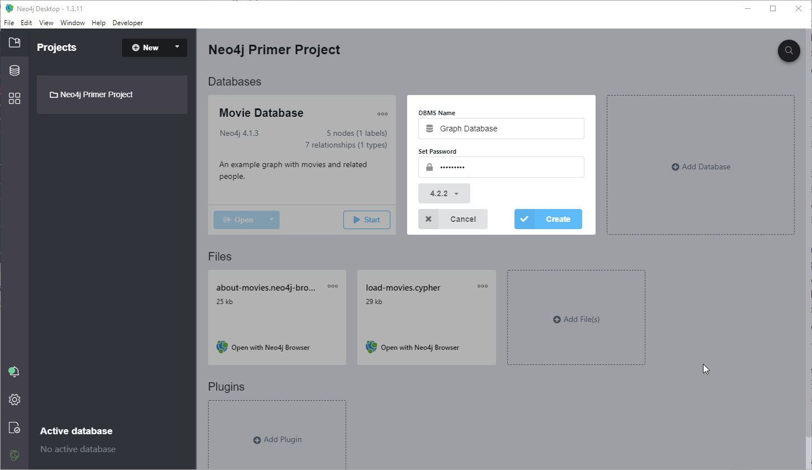
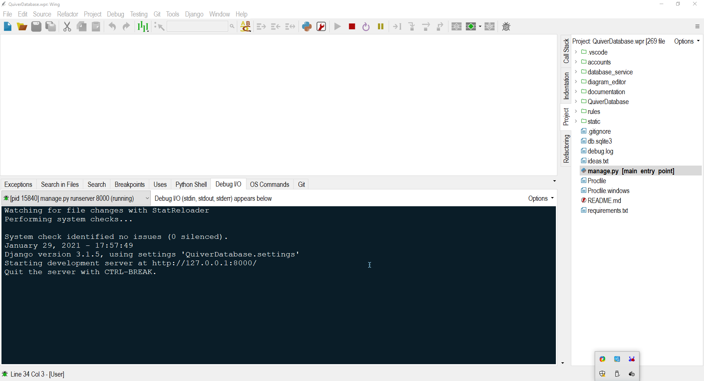
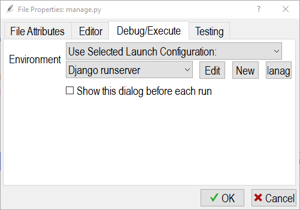

# QuiverDatabase

## Dev Setup

1. Install Python 3.x if you need to.  Notes:
    - If you're new to python, try the latest: https://www.python.org/downloads/
    - I recommend doing a custom install (option in installer) to "C:\Python39" for example (on Windows), but
    it is not required.
    - Make sure to select **Add To Path** in the installer.
    
2. Install Neo4j Desktop:
    - From here: https://neo4j.com/download/ 
    - Regardless of what you see on the screen, no API key is required (unless you're doing a commercial license), so skip any such screen.
    
3. Open Neo4j Desktop, and in the Primer project or any new project, create a local graph database.
    - The database can have any name (try maybe "Category Theory" or "Mathematics" if you want).
    - Use the password `fusion123`.
    - Use default settings for everything else such as the Neo4j version.
    

4. Clone this repository (I use TortoiseGit Shell extension on Windows).

5. Cd to to the project directory from the command line and do: `pip install -r requirements.txt`
    - This will install the various python libraries that this project uses.
    - If we don't need a requirement any more, you have to make sure to delete it from this text file.
    - Use "library_name==0.3.7" notation to select a specific version of a particular library to install.
    - When and if we deploy to Heroku, Heroku recognizes this text file each deploy and makes sure everything's installed.

6. Install WingWare (Pro):  
    - https://wingware.com/downloads/wing-pro
    - Use this because I've included a .wpr project file that is configured for Django dev.
    - Needs to be pro version if you want the debugging tools enabled.
    
7. Open up the .wpr file located in the root directory of this project in WingWare IDE.
    - You should see **manage.py** bolded which means it is the used as the debug entry point.  If not, right-click 
      manage.py in the "Project" panel (Menu > Tools > Project), and select "Set As Main Entry Point".
      
8. Hit the "Play" button at the top or alternatively hit F5 key to start debugging.  You should see the following
   in the "Debug I/O" panel:
   
   
9. Accessing the project environment variables:
    - Right-click manage.py in the Project panel.  Select "File Properties..." at the very end.
    - Select the Debug/Execute tab.  You should see:
    - 
    - Click "Edit".
    - The important environment variables should read:
        ```
        NEO4J_HOST=localhost
        NEO4J_PASSWORD=fusion123
        NEO4J_PORT=7687
        NEO4J_USER_NAME=neo4j
        DISABLE_COLLECTSTATIC=1
        ON_HEROKU=0``
        
    - Leave the "secret key" alone, of course when we deploy to production we'll have to change these settings.
    - Let's all agree to use the same project file and thus the same password `fusion123`.
    - Let's also all agree on a port number to use, so if some of you have occupied port 7687 already,
    we'll have to come up with a new setting.
    
10. If you don't want to use WingWare Pro, please edit this readme with how to get the project running in another IDE.
   I can help you in the issues forum of this github page if you're new to Django / Python.
   
11. Before running and if anything database-related should fail.  Try these:
    - Make sure the graph database is started from within Neo4j desktop (the "Start" button where you added the DB).
    - Try stopping / restarting the database.
    - Try stopping / restarting Neo4j desktop and the database.
    - Try restarting your machine and the database.
    
12. For observing that QuiverDatabase is making correct changes to the DB:
    - Click "Open" on on the database (right next to "Start") once you've started it.
    - This opens the Neo4j browser.  With it, you can run Cypher commands such as:
    - `MATCH (n) DETACH DELETE n`  
    (Go ahead and click the "star" icon after executing and save it as "Delete Everything")
    - `MATCH (n) RETURN n`
    (Go ahead and also favorite this one as "Return All Nodes")
    - These favorites will remain in the browser, even if you delete and recreate the database.
    - Favorites are useful when you're debugging the Neomodel code.
    
13. Don't be afraid to ask how to develop something on this project in the attached issues forum.
    I'm happy to teach you how I made a certain thing work for this project.
    
14. If you have any questions about how the overall design is going to work, also please ask in the forum.
    - Essentially, I propose a diagram rule system.
    - These rules get applied at the click of button by the user, should there diagram match (exactly) the key diagram of a 
    certain rule.  
    - The result diagram of the rule is then what the user sees once they click the button.
    - There are buttons to move backward and forward in the logical sequence.
    - We may need more than a 1 Key, 1 Result schema for rules.  Maybe an "Up to 4" keys and 1 result (?)
    - Please help us brainstorm about the logical machinery of our application.

15. We need to raise money to go live using GrapheneDB:
    https://www.graphenedb.com/pricing.html
    - However, we are nowhere close to ready for this.  Let's get everything working perfectly on our local machines before
    we deploy to a paid host.

16. The project's folder structure along with procfiles already supports deployment to Heroku, and it works fine, except
    I currently do not have a reliable Neo4j host.
    
17. To test out the current features:
    - Run the site with `python manage.py runserver 8000` or hit "Play" in WingWare.
    - Sign in with credentials: `TestEditor` and `fusion123`.
    - Click "Create Diagram".  Give it a name.  Click "Create".
    - Edit the diagram.  Click "Save".
    - Hit the refresh button on the browser.  This will load whatever diagram id is in the URL, from the Neo4j database!
    - You can also verify writes using Neo4j Browser.
    
    
## Videos of The Code Working

